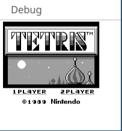
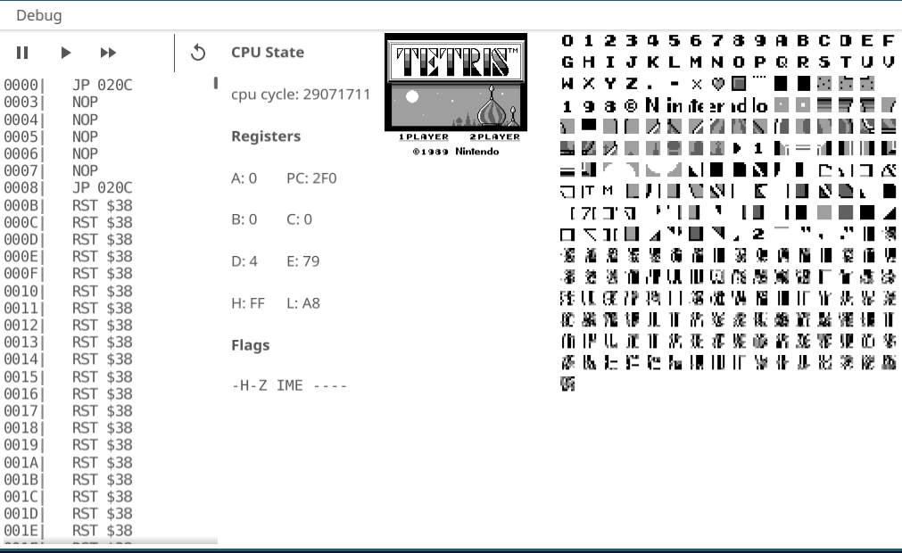

# MaybeGo

## Todo

  - [ ] CPU
    - [X] instructions
    - [x] define constants for registers for easier recognition
    - [x] testing  
  - [ ] Memory
    - [x] basic rw
    - [x] testing rw
    - [ ] memory map
  - [ ] PPU
    - [ ] BG (wip)
      - [ ] scroll
    - [ ] Window
    - [ ] Sprites
  - [ ] APU
  - [ ] Input
  - [ ] UI
    - [ ] Debugger
      - [x] VRAM view
      - [x] tilemap view
      - [x] code disassembly
        - [x] breakpoints
        - [x] step, step in, continue, pause buttons
        - [x] mark breakpoints
        - [ ] scroll to current PC
        - [x] mark current PC
        - [ ] disable breakpoints
      - [ ] memory view
    - [ ] Menu Bar with ROM selection
      - [ ] reset ROM
   - [ ] CI support running unit tests
